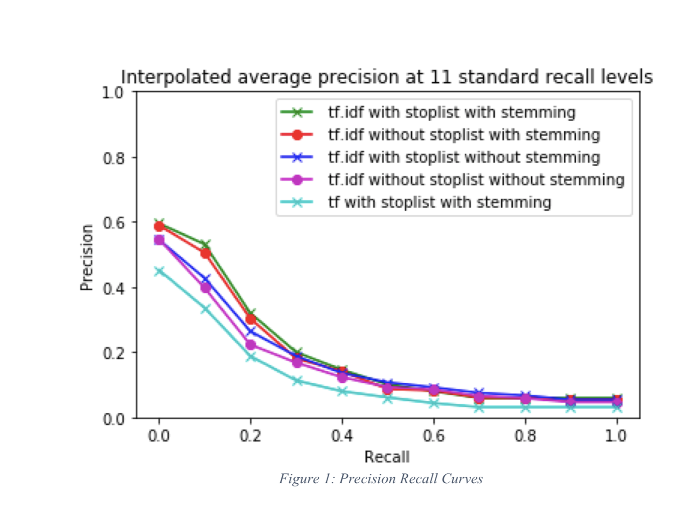

# Document-Retrieval-System-Text-Processing

###### Goal: 

To retrieve top 10 documents for each query using three schemes namely binary, tf anf tf.idf

###### Implementation:

Class Retrieve:

   def __init__ (self, index, termWeighting):
     
• Initialize index, term weighting scheme.

• Construct inverse index dictionary {document id > term > count}.

• Construct document frequency(df) dictionary.

• Compute d_square

• Compute inverse document frequency (idf). def forQuery (self, query):

• Get Candidate documents.

• if (self. termWeighting == 'tf'):
     return Retrieve.tf (query, Candidate documents, inverse index)
     
  elif (self. termWeighting == 'tfidf'):
     return Retrieve.tf_idf (query, Candidate documents, inverse index, size of document collection, self. index, document frequency, inverse document frequency)
     
  elif (self. termWeighting == 'binary'): return Retrieve.binary(query, documents, inverse index)
  
  else:
     return Retrieve.binary(query,documents, inverse index)

###### Performance evaluation:

 Here we are evaluating the system based on the ranked retrieval approach. Document retrieval is carried out using three-term weighting schemes which are binary, tf and tf.idf. Considering evaluation metric “F-measure” which is the harmonic mean of precision and recall, the top 5 configurations w.r.t F-measure values considering the first 10 responses for each query are as follows:
 
 ###### Table 1: IR Evaluation metrics for different configurations
Configuration | Precision | Recall | F-measure
------------ | ------------- | ------------ | -------------
tf.idf - with stoplist with stemming | 0.27 | 0.22 | 0.24
tf.idf – without stoplist with stemming | 0.26 | 0.21 | 0.23
tf.idf – with stoplist without stemming | 0.22 | 0.18 | 0.19
tf.idf – without stoplist without stemming | 0.21 | 0.17 | 0.18
tf - with stoplist with stemming | 0.19 | 0.15 | 0.17

###### Figure 1: Precision Recall Curves

Figure 1 shows the precision-recall curve for all the above configurations. Ideally, if the precision-recall curve is more towards the upper right corner (which means all the retrieved documents are relevant), then the system is good.

Here the requirement of our IR system is to retrieve all and only the relevant documents.All the curves with different configurations in Figure 1 shows almost similar trend. So here I will consider the system “tf.idf - with stoplist with stemming” which is more towards the upper right corner to be good.

The relevant documents retrieved by “tf.idf - with stoplist with stemming” system is greater as compared to other systems and hence has high precision. The major difference in the graph is seen between “tf.idf - with stoplist with stemming” and “tf- with stoplist with stemming” system. If we compare these two IR systems, then precision for “tf- with stoplist with stemming” is less at all recall points. Hence, the “tf.idf - with stoplist with stemming” is the good IR system as compared to “tf- with stoplist with stemming” system.

Also, the binary term weighting scheme retrieves very less relevant documents and hence has low values of F-measure as compared to tf and tf.idf. Thus arranging the term weighting schemes in descending order of there performance are as follows, tf.idf > tf > binary. And from all the configurations in tf.idf term weighting scheme, “tf.idf - with stoplist with stemming” gives the highest F-measure = 0.24 with relevant retrieval of 172 documents.

###### Shortcomings of the algorithm:

As the number of queries will increase, the retrieval time will increase thus reducing the efficiency w.r.t. retrieval time.
